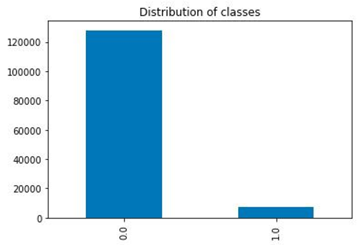

# Electricity-and-Gas-Fraud-Detection

## Background \& Motivation 

The Tunisian Company of Electricity and Gas (STEG) is a public and a non-administrative company responsible for delivering electricity and gas across Tunisia. The company suffered tremendous losses in the order of 200 million Tunisian Dinars (~86 mil SGD) due to fraudulent manipulations of meters by consumers.

**Motivation:**
- Electricity fraud is a significant issue in developing countries
- E.g. 20% of total electricity production in India is lost due to electricity fraud and theft
- Obstruct the economic growth of these developing countries - lose $58.7 billion per year due
to electricity theft
- By eliminating electricity and gas fraud, economic growth can improve and in turn reduce
poverty and increase quality of life.

**Dataset:** Fraud Detection in Electricity and Gas Consumption Challenge

## Problem Statement 
There is a need to <u>detect the patterns</u> that are associated with fraud in Tunisia. However, there are <u>a lot of challenges</u> that complicate the detection of electricity and gas fraud. Therefore, we aim to <u>use Machine Learning algorithms</u> to detect and identify clients committing fraud against the Tunisia company of Electricity and Gas.

## Dataset Analysis

### Overview of Dataset

Data was split across two csv files:

```client.csv```:

Each instance of the client csv file was unique to each client and contained relevant information with features such as client_id, region, creation_date and more importantly target (which classified the instance according to fraud or no fraud committed).

```invoice.csv```:

In the invoice csv file, each client could have multiple instances as identified by client_id and they contained invoice information with features such as invoice_date, counter_number, consumption_level, counter_type, old_index and new_index.

### Problems With the Dataset
**Heavily Imbalanced Dataset**




**Unclear/Inconsistent Features**

Multiple invoices share a client, labels associated with clients Consumption_level divided across different levels

**Lacked Proper Test Set**

Original dataset designed for competition Had to improvise and section out training set


## Feature Engineering
```client_id, district, client_catg, region, region_group, creation_date_day, creation_date_month, creation_date_year, no_months_as_client, services_consumed, target, months_of_service, number_of_counter, number_of_instances, number_of_person_counting, min_reading_remark, max_reading_remark, mean_reading_remark, mean_difference_index, sum_difference_index, min_difference_index, max_difference_index, min_counter_statue, max_counter_statue, mean_counter_statue, mean_diff_counter_cofficient, sum_counter_coefficient, mean_counter_coefficient, min_counter_coefficient, max_counter_coefficient, sum_total_consumption, mean_total_consumption, min_total_consumption, max_total_consumption, tally_check_true, tally_check_false, sum_tally_value, min_tally_value, max_tally_value, mean_tally_value, counter_type, last_year, last_month, last_day, last_day_is_weekday```

**Key Additions**

- ```client_id```: To group all invoices done by the same client
- min/max/mean/sum of various attributes (under the same client)
- Last year/month/day
- classified region into groups

**Notes**

- Fraud -> Positive, No Fraud -> Negative
- Punish False Negatives over False Positives